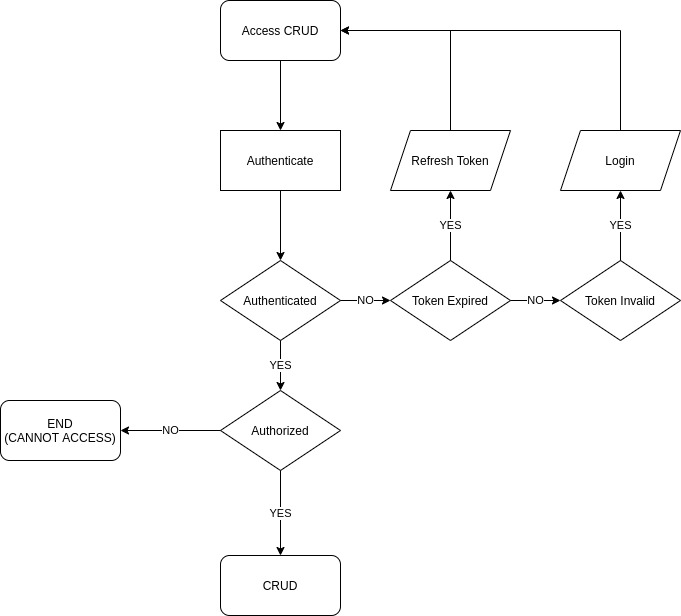

<h1>SejutaCita Test</h1>

<a href="https://documenter.getpostman.com/view/3324866/UVBzoVk5">API Documentation</a>

<h3>Docker Build</h3>
<code>docker-compose build</code> or <code>docker-compose up</code>

  <h3>Kubernetes Configuration</h3>
    <code>kubectl -f apply kubernetes.yaml</code>

<h3>Kubernetes Screenshot</h3>

 

<h3>Diagram</h3>

 

<h3>Default Credentials</h3>
  <h5>Role Admin<h5>
  <table>
    <tr>
      <td>email</td>
      <td>john@mail.com</td>
    </tr>
    <tr>
      <td>password</td>
      <td>123456</td>
    </tr>
  </table>
  
  <h5>Role User<h5>
  <table>
    <tr>
      <td>email</td>
      <td>doe@mail.com</td>
    </tr>
    <tr>
      <td>password</td>
      <td>123456</td>
    </tr>
  </table>
    
  
 
